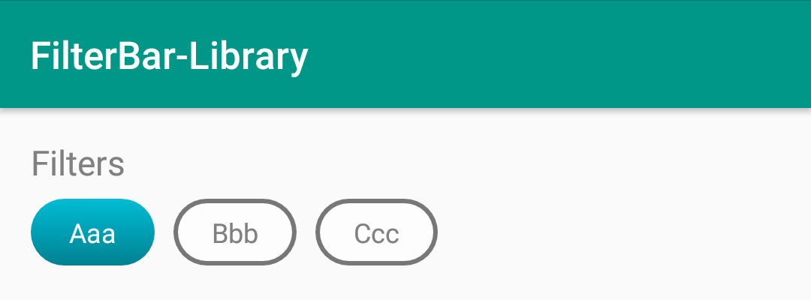
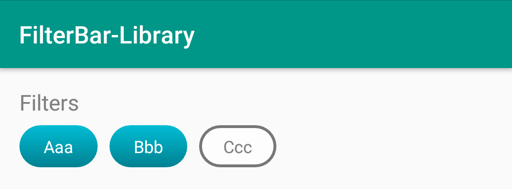

# FilterBar-Library

## Preview
- Exclusive, single selection


- Not Exclusive, multiple selections


## Gradle Dependency
- gradle project level
 ```gradle 
allprojects {
    repositories {
        // ...
        maven { url 'https://jitpack.io' }
    }
}
```
- gradle application level
```gradle 
dependencies {
    implementation 'com.github.FabrizioBilleciUNICT:FilterBar-Library:0.1'
 }
 ```


## Usage
- Kotlin

 ```kotlin
    val fb = FilterBar(this, true, listOf("Aaa", "Bbb", "Ccc"), arrayListOf("Aaa"), "Filters")
    yourView.addView(fb)

    fb.filterUpdated = {
        System.err.println(it)
        // use filter list
    } 
```
